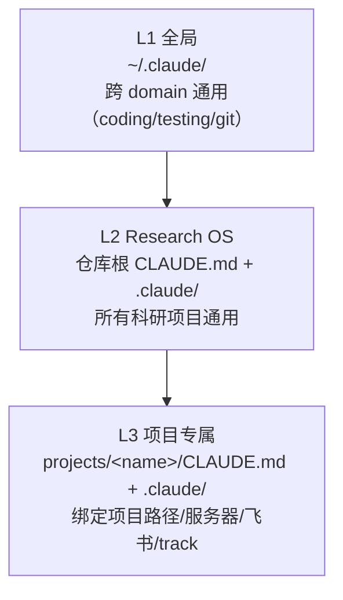
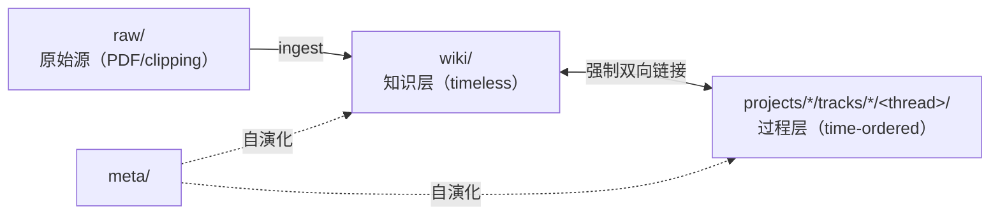
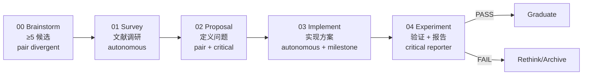

# Research OS — Claude 辅助科研的个人操作系统模板

> **定位**：基于 Claude Code 的跨项目科研操作系统模板，覆盖研究 thread、写作、学习、日程。
> **设计 ADR**：[decisions/ADR-0001-research-os-architecture.md](decisions/ADR-0001-research-os-architecture.md) · [decisions/ADR-0003-open-source-split.md](decisions/ADR-0003-open-source-split.md)

---

## 1. 三层作用域架构（最关键）

Claude Code 会沿目录树**层叠加载**多个 `CLAUDE.md` / `.claude/`，本 OS 按三层组织：



**判断标准**：

| 范围 | 放哪里 | 例子 |
|------|--------|------|
| 跨 domain 都用 | L1 `~/.claude/` | Python 风格、git 规范、测试框架 |
| 所有科研项目都用 | L2 仓库根 | 文献调研规范、学术图表风格、代码讲解 skill、sub-agent 编排规则 |
| 只一个项目用 | L3 `projects/<name>/` | 远程服务器、conda 环境、飞书文档 token、项目专属数据格式、Wave 迁移状态 |

拿不准先放 L2；后续发现只一个项目用再下沉 L3。

**L2 与 L3 文档分工**：

| 文档 | 位置 | 性质 | 内容 |
|------|------|------|------|
| L2 `CLAUDE.md` | 仓库根 | 骨架宪法（稳定） | 架构、流程、规范、通用工作习惯 |
| L2 `.claude/HANDOFF.md` | `.claude/` | Session 入口指南 | 任务模式分流、规则索引、项目入口表 |
| L3 `CLAUDE.md` | `projects/<name>/` | 项目宗法（稳定） | 项目定位、当前 baseline、远程环境、track 盘点、Wave 迁移终态 |
| L3 `.claude/HANDOFF.md` | `projects/<name>/.claude/` | 项目 session 入口 | 当前活跃 thread、下一步候选（动态，每 session 更新） |

---

## 2. Dual-Primary 知识架构



| 层 | 性质 | 写什么 |
|----|------|--------|
| `raw/` | Immutable sources | 落盘后只读 |
| `wiki/` | Entity-per-page 知识网络（**跨项目共享**） | 客观事实、对比、综合论点、矛盾标记 |
| `projects/<name>/tracks/<track>/<thread>/` | 五阶段研究过程 | 决策叙事、假设、否决理由、失败教训 |
| `meta/` | 系统自身的演化记录 | Frictions、improvements backlog、weekly review |

### `raw/` → `learning/` → `wiki/` 三段管道（非任务驱动阅读）

除了任务驱动的 thread 走 `raw/ → wiki/` 之外，**大神 blog / GitHub 笔记 / 行业动态**这类非任务驱动阅读单独走一条管道（见 [ADR-0004](decisions/ADR-0004-learning-sources-and-skills-split.md)）：

```
raw/clippings/<slug>.md        ← 原始 HTML / 引用截图 + 原链接（immutable）
       ↓  "读完这篇，对我有什么启发？"
learning/<slug>.md              ← 消化笔记：核心论点、适用 / 不适用、下一步想法
       ↓  "多篇凑起来综合出一个论点了吗？"
wiki/syntheses/<theme>.md       ← 跨多个源的综合论点（可选；够级别才升级）
```

不加 `wiki/blogs/` 子目录——blog 的权威性远低于 paper，放同层会误导 citation 判断。如果某个 blog 的作者本身被反复引用且有锚点（作者 + 日期 + 链接），**降级做法**是进 `wiki/papers/` 并在 frontmatter `type: blog-post`，默认还是走上面三段管道。

**双向链接合同**：thread phase doc 的 `wiki_touches:` frontmatter ↔ wiki page 的 `## Touched By`（lint 自动同步）。

**页面格式约定**（2026-04-25 Wave C+ 起）：每个 wiki 页采用**双层元数据**模式——YAML frontmatter（机器读，lint/索引/工具用）+ 正文 H1 后紧跟一个 `> [!NOTE] <Type> Meta` 回销块（人读，VSCode / GitHub 原生 markdown preview 可视化呈现）。`> [!NOTE]` 采用 GitHub Alerts 官方保留 5 标签之一（NOTE / TIP / IMPORTANT / WARNING / CAUTION），兼容 VSCode / GitHub / Obsidian。字段与 frontmatter 保持一致，未核实项标 `*[TODO 待核实]*`。具体模板见各 `wiki/<type>/_README.md`。

**关键取舍**：wiki **跨项目共享**（放 L2 而非 L3），因为"Transformer"、"GraphSAGE"、"某篇论文"在多个项目都可能引用。threads 放 L3（项目专属过程）。

### Tracks（研究方向分类层）

每个项目下，具体 thread 按**研究方向**归类到 `tracks/<track-name>/`。track 层的设计理由和规范见 [decisions/ADR-0002-tracks-and-ideas-inbox.md](decisions/ADR-0002-tracks-and-ideas-inbox.md)。

每个 track 有自己的 `_index.md`，说明"为什么做这个方向 + 成功判据 + 子任务表"。

### IDEAS.md（突发奇想 / mentor 分配 inbox）

每个项目一个 `projects/<name>/IDEAS.md`，**2 分钟成本**记录新想法——不走五阶段、不建 thread、只占一行。weekly meta-review 批量 triage：promote 为 thread / archive / parking。

---

## 3. 五阶段研究流程

每个研究方向分类（track）下，具体任务是一个 **thread**（`projects/<name>/tracks/<track>/<slug>/`），依次走过：



每阶段：Claude 扮演对应 agency，产出 md 文档，status=done/accepted 后才能推进。禁止跳阶段。完成的阶段文档不再修改——新发现开 v2 版本。

论文写作素材层建议单独拆 `05-writing-material.md`（五层结构：一句话结论 / 中文段落 / 英文 PPT 文字 / 子图图例 / 论文段落草稿 / 总图例）。

---

## 4. Self-Evolving 机制

```text
Real-time capture → Session-end auto-grep → Weekly meta-review
```

| 层 | 做什么 | Artifact |
|----|--------|----------|
| 实时 | 发现 friction → 追加一行 md | `tracks/*/frictions.md` 或 `meta/frictions-backlog.md` |
| Session-end | grep 所有 friction → 汇总 | `meta/frictions-backlog.md` |
| Weekly | 批量处理 → 改规则 / 补模板 / 写 ADR | `meta/reviews/YYYY-MM-DD.md` + 新 ADR |

**Friction** = 系统中任何不够用的地方（规则空白 / 模板缺章节 / 命令缺失 / Claude 误解）。捕获成本低，决策批量做，不打断研究 flow。

---

## 5. Skill 规范（Anthropic 官方三层）

```text
metadata (name + description, 简洁 ~100 词, 用于 LLM 决策是否加载)
  → SKILL.md 主体 (<500 行, narrative 解释 why 而非 ALWAYS/NEVER 清单)
    → references/ 吸收细节 (路径、已知坑点、具体参数)
```

**禁止**：大段 ALWAYS/NEVER/MUST 清单；要**解释 why**，用 theory of mind。

**三类内容分离**：
- 稳定的工作流指令 → `SKILL.md`
- 易变的项目状态（baseline 路径、实验状态、SSH 服务器）→ `references/`
- skill 自身的自动化脚本 → `scripts/`（不放业务代码包装器）

---

## 6. 本 OS 目录地图

```text
research-os/
├── CLAUDE.md                        ← L2 骨架宪法（本文件）
├── README.md                        ← 开源门面
├── .gitignore
│
├── .claude/                         ← L2: Research OS 级
│   ├── HANDOFF.md                   ← 新 session 启动入口（通用任务分流）
│   ├── skills/                      ← 跨科研项目通用 skill
│   └── rules/                       ← 跨科研项目通用规则
│
├── projects/
│   ├── README.md                    ← 新建项目指南 + 命名约定
│   └── <name>/                      ← 具体项目（每个项目一个）
│       ├── CLAUDE.md                ← L3 项目宗法（远程环境、track 盘点、Wave 状态）
│       ├── README.md                ← 项目总览（TL;DR + track 列表 + 核心数字）
│       ├── IDEAS.md                 ← 突发奇想 / mentor 分配 inbox
│       ├── .claude/                 ← L3 项目专属
│       │   ├── HANDOFF.md           ← 项目 session 入口（当前活跃 thread）
│       │   ├── rules/               ← 项目专属规则
│       │   └── skills/              ← 项目专属 skill
│       └── tracks/
│           └── <track>/
│               ├── _index.md        ← 本 track 总览（why + 成功判据 + 子任务表）
│               └── <thread>/        ← 具体任务，走五阶段
│                   ├── README.md
│                   ├── 00-brainstorm.md … 05-writing-material.md
│                   └── frictions.md
│
├── wiki/                            ← L2: 跨项目知识库
│   ├── index.md, log.md
│   └── papers/ concepts/ datasets/ benchmarks/ syntheses/
│
├── raw/                             ← 跨项目文献/原始源
│   ├── papers/ clippings/
│   └── manifest.json
│
├── learning/                        ← 非任务驱动阅读
├── writing/                         ← 论文/毕业论文素材入口
├── schedule/                        ← ToDo / 日程
│
├── decisions/                       ← L2 架构 ADR
│
├── meta/                            ← Self-evolving 层
│   ├── frictions-backlog.md
│   ├── improvements-backlog.md
│   └── reviews/
│
├── journal/                         ← 每日 lab notebook
│
└── memory/                          ← L2 全局 memory（跨项目）
```

---

## 7. 飞书（或其他外部协作平台）的定位

外部协作平台（飞书 / Notion / Confluence / 等）= **镜像视图**（分享给导师、合作者），**不是权威来源**。

- 本地 md 是源。
- 从 thread 产出"送审版"推到外部。
- 外部页面反过来不驱动本地。
- 若外部被手改，下次 pull 时 Claude 指出 diff 并询问如何 merge。

项目可在 L3 rules 里实现自己的"镜像工作流"规范，约定 tag 体系、父子页面结构、同步时机。

---

## 8. 引用的规则与资源

| 类型 | 文件 |
|------|------|
| 文献调研与汇报规范 | [.claude/rules/research-and-reporting.md](.claude/rules/research-and-reporting.md) |
| 学术图表风格 | [.claude/rules/figure-style-guidelines.md](.claude/rules/figure-style-guidelines.md) |
| 外部平台镜像工作流 | [.claude/rules/feishu-mirror-workflow.md](.claude/rules/feishu-mirror-workflow.md) |
| 实验重跑 vs 保留旧版 | [.claude/rules/rerun-vs-archive.md](.claude/rules/rerun-vs-archive.md) |
| 代码变更讲解 skill | [.claude/skills/own/code-walkthrough/SKILL.md](.claude/skills/own/code-walkthrough/SKILL.md) |
| 新 session 启动入口 | [.claude/HANDOFF.md](.claude/HANDOFF.md) |
| 项目专属宗法 | `projects/<name>/CLAUDE.md`（L3） |
| 项目专属规则 | `projects/<name>/.claude/rules/`（L3） |
| 项目专属 skill | `projects/<name>/.claude/skills/`（L3） |
| 跨项目 memory | [memory/MEMORY.md](memory/MEMORY.md) |

---

## 9. 项目挂载入口

任务涉及具体项目时，**`cd projects/<name>/`**——Claude Code 会沿目录树层叠加载 L3 `CLAUDE.md` 和 `.claude/`。项目专属的远程环境、track 盘点、Wave 迁移状态等**都在 L3，不放 L2**。

当前仓库的已挂载项目：见 `projects/README.md`。

**新建项目**：读 `projects/README.md` 的"新建项目指南"——它说明命名约定、最小骨架、L3 `CLAUDE.md` 模板。

---

## 10. 模板版本

| 版本 | 日期 | 主要变更 |
|------|------|---------|
| v1.0 | 2026-04-20 | Research OS 三层作用域初立；ADR-0001 三层架构；ADR-0002 tracks + IDEAS |
| v1.1 | 2026-04-25 | L2/L3 CLAUDE 分层清晰化；ADR-0003 开源拆分；sub-agent 编排规则 + staging pattern 沉淀到 §11 |
| v1.2 | 2026-04-25 | ADR-0004 落地：`raw/ → learning/ → wiki/syntheses/` 三段管道 + `.claude/skills/{own,upstream}/` 拆分 + 首批 4 个 upstream skill mirror + 中英双 README |
| v1.3 | 2026-04-25 | README 精简到 karpathy 量级 (~200 行) + 架构图出 README 进 [docs/architecture.md](docs/architecture.md) + Karpathy 4 原则压缩版进 CLAUDE.md §12 作为默认行为基线 |

项目自身的迁移进度（Wave A/B/C/D 等）记录在对应 L3 `projects/<name>/CLAUDE.md`，不在本文件。

---

## 11. 会话工作习惯

- **中文为默认工作语言**，除非任务涉及英文稿件撰写。
- **文件命名与路径用标准英文**（lowercase + hyphen，文件系统友好）；**文档内容用标准中文**（便于用户阅读）；**专有名词保持英文**（Transformer、GraphSAGE、PPI、HPI、SSL 等）。
- **作者署名**：frontmatter 的 `author:` 字段填 `<你的名字> + Claude`。
- 代码注释、变量名用英文。
- 跨 session 不代替用户决策——旧 plan / implementation 只汇报状态，等用户显式"继续""执行"才动手。
- 长任务（训练/推理）后台 sub-agent 轮询，主 agent 保持空闲接收新任务。
- **Session 结束前**：git commit + push；不跨 session 积累未提交改动。

### Sub-agent 使用规则（保持主 agent context 干净）

**核心原则**：**独立的子任务尽量开 sub-agent 处理**，主 agent 只负责编排、核对、决策，不亲自读大量原始材料。理由：

1. **主 agent context 消耗**：每次 Read 一份长文档（数百行 raw、PDF、大日志）就吃掉数 K context，连续做多个同类任务后 context 接近耗尽，影响后续决策质量。
2. **subagent 天然隔离**：每个 subagent 起一份独立 context，完成后只返回 ≤ 300 字摘要。主 agent 只看摘要，不接触 raw 材料。
3. **并行加速**：独立 subtask 可并发发射（如"4 个相似任务" → 4 subagent 并行 ~10 分钟 vs 主 agent 串行 30-40 分钟）。

**何时必须用 sub-agent**（非穷尽清单）：
- **批量同类任务**：一次处理 3+ 个同形状的子任务。
- **长原始材料阅读**：单个任务需要读 > 1000 行的 raw 文件、PDF 或日志才能产出结论。
- **长耗时工作**：subagent 后台跑同时主 agent 可以和用户继续对话、处理其他任务。
- **探索式搜索**：在大仓库里 open-ended 搜索（用 `Explore` 或 `general-purpose`），避免主 agent 多轮 Grep 污染 context。

**何时不要用 sub-agent**：
- 只改 1-2 个小文件（Read + Edit 1 次完成）。
- 用户正在跟主 agent 讨论架构决策，需要主 agent 直接参与理解上下文。
- 任务本身就是"决定是否派 subagent"的元层编排。

**编排规范**（派 subagent 的正确姿势）：

1. **写 spec 文件**：超过一次性任务，把共同流程/铁律/参考样本路径写成一个 `_<task>-spec.md`，所有 subagent 先读 spec 再干活。spec 文件任务后即删。
2. **给自足 prompt**：subagent 没有会话历史，prompt 要包含目标、输入路径、输出路径、格式要求、"不要做"的铁律。参考样本用绝对路径指明。
3. **限制输出长度**：要求 `< 300 字报告`，列出变更摘要 + 文件列表 + 问题，不贴 diff。
4. **并行发射**：多个 subagent 放在**同一条消息**里一次发，标 `run_in_background: true`，等系统通知完成。
5. **主 agent 只做事后核对**：subagent 返回后，主 agent 用 `ls` / `grep` 验证产出、Read 关键文件抽样 sanity check，不要整个重读一遍 subagent 的工作产出（那会让 subagent 的隔离优势归零）。

### `.claude/` 沙箱写保护 + Staging Pattern

**现象（2026-04-25 发现）**：subagent 对任何 `.claude/` 路径（主项目 `.claude/` 或 `projects/<name>/.claude/`）的 Write / Edit / Bash mkdir 都会被沙箱拒绝；但主 agent 没有这个限制。UNC 路径同样被拒绝写。

**Staging pattern**：当需要 subagent 产出落到 `.claude/` 或 UNC 路径时，走两步接力：

```
源（只读）
  ↓  subagent: Read source → rewrite in context → Write to staging area
中转区（e:/tmp/<task>-staging/ 或其他非 .claude 路径）
  ↓  主 agent: cp -r staging → final
最终位置（.claude/skills/<skill>/）
```

**约束**：

- Staging 目录选 **`e:/tmp/`** 或 `tracks/_staging/` 等**非 .claude** 路径——subagent 能写
- Subagent prompt 里**明确**告诉它写 staging，不要让它自己尝试写 `.claude/`（否则会反复尝试浪费时间）
- 主 agent 的 cp 操作是批量的，用 Bash `cp -r staging/<name>/* final/<name>/` 一次完成，不 Read staging 内容避免 context 膨胀
- 落地后 `rm -rf staging/` 清理

**何时用 staging**：产出目标在 `.claude/` 或 UNC 路径；或任何 sandbox 拒绝写的目录（以错误信息为准）。

**何时不用**：目标在普通本地路径（非 .claude 目录）——subagent 直接写，避免多一步周转。

---

## 12. 默认编码行为准则（Karpathy 四原则）

> 本节采纳自 [Andrej Karpathy 关于 LLM 编码陷阱的观察](https://x.com/karpathy/status/2015883857489522876)，由 [forrestchang/andrej-karpathy-skills](https://github.com/forrestchang/andrej-karpathy-skills) 整理成 skill（MIT license）。完整版见 [`.claude/skills/upstream/karpathy-guidelines/SKILL.md`](.claude/skills/upstream/karpathy-guidelines/SKILL.md)。本节是压缩版，作为每个 session 的默认行为基线。

这四条直接解决 LLM 写代码时最常见的四类失败。**对 trivial 任务（改错别字、一行 fix）用判断力，别机械套用**。

### 1. Think Before Coding — 不要默默假设

不确定就问。有多种解释就列出来，别自己挑一个默默实现。遇到简单方案就提议用简单方案。遇到卡住就停下来指出"这里我不清楚"。

### 2. Simplicity First — 最小够用的代码

只做用户要的，不做"以后可能需要的"。不给一次性代码写抽象。不做没被要求的"灵活性"。不处理不可能发生的错误场景。200 行能写成 50 行就重写。

**自检**：资深工程师会觉得这过度复杂吗？如果会，简化。

### 3. Surgical Changes — 只碰必须碰的

改代码时不顺手"改进"相邻代码、注释、格式。不重构没坏的东西。匹配现有风格，即使你有更好的写法。看到无关的 dead code 提一下，不要删。

**自检**：每一行改动都能直接追溯到用户请求吗？

### 4. Goal-Driven Execution — 定义成功标准，循环到达成

把祈使任务变成可验证的目标：
- "加校验" → "为非法输入写测试，让它们通过"
- "修 bug" → "写一个复现测试，让它通过"
- "重构 X" → "确保重构前后测试都通过"

多步任务先写简短计划：`1. [步骤] → 验证：[检查点] · 2. ... · 3. ...`。强成功标准让 Claude 独立循环；弱标准（"让它能跑就行"）会导致反复澄清。

---

