# Architecture

Detailed architecture for `claude-research-os`. For the short version, see [README.md](../README.md).

---

## Three scopes, cascading

Claude Code walks from your current working directory upward, loading every `CLAUDE.md` and `.claude/` it finds along the way. Research OS uses that mechanism to split rules into **three physical scopes**:

```mermaid
%%{init: {'theme':'dark', 'themeVariables': {'primaryColor':'#1f2937', 'primaryTextColor':'#f3f4f6', 'primaryBorderColor':'#6b7280', 'lineColor':'#9ca3af', 'fontFamily':'ui-sans-serif, system-ui, -apple-system, Segoe UI, Roboto', 'fontSize':'14px'}, 'flowchart': {'curve':'linear', 'nodeSpacing':60, 'rankSpacing':80}}}%%
flowchart LR
    subgraph L1["<b>L1 · Global</b><br/><small>~/.claude/</small>"]
      direction TB
      L1a["Coding conventions"]
      L1b["Git / Testing"]
      L1c["Cross-domain rules"]
    end

    subgraph L2["<b>L2 · Research OS</b><br/><small>this repo</small>"]
      direction TB
      L2a["Five-stage research flow"]
      L2b["Dual-Primary: wiki + threads"]
      L2c["Self-evolving frictions"]
      L2d["Batteries-included skills"]
    end

    subgraph L3["<b>L3 · Per-project</b><br/><small>projects/&lt;name&gt;/</small>"]
      direction TB
      L3a["Project charter"]
      L3b["Tracks &amp; threads"]
      L3c["Remote env / data format"]
      L3d["Project-specific skills"]
    end

    L1 -.inherits.-> L2
    L2 -.inherits.-> L3

    classDef l1 fill:#0b2545,stroke:#3b82f6,stroke-width:1.5px,color:#f3f4f6
    classDef l2 fill:#3d2e12,stroke:#f59e0b,stroke-width:1.5px,color:#f3f4f6
    classDef l3 fill:#14351f,stroke:#16a34a,stroke-width:1.5px,color:#f3f4f6
    class L1 l1
    class L2 l2
    class L3 l3
```



| Scope | Where | Holds | Who shares it |
|-------|-------|-------|---------------|
| **L1 · Global** | `~/.claude/` | Python / Git / testing conventions, cross-domain rules | All Claude Code sessions |
| **L2 · Research OS** | this repo root | Skeleton, academic writing rules, cross-project `wiki/`, batteries-included skills, `decisions/`, `meta/` | Every research project |
| **L3 · Per-project** | `projects/<name>/` | Project charter, baseline, remote env, active threads, project-specific skills | Only that project |

**Rule of thumb.** Unsure where a new rule goes? Put it at L2. If you later find only one project uses it, sink it to L3.

---

## Two knowledge stores: Dual-Primary

Research knowledge has two natures:

- **Timeless** — what "Transformer" is, what STRING's 7 edge channels mean, what a paper's core claim is. Yesterday's definition is today's definition.
- **Time-ordered** — at T0 I considered X, at T1 I rejected it because Y, at T2 I decided Z. Strip the narrative and the meaning disappears.

Traditional note systems (Obsidian / Notion) put both on the same page. Result: the page is neither a clean fact sheet nor a clean decision log.

Research OS physically separates them:

| Store | Path | Content | Read when |
|-------|------|---------|-----------|
| **Wiki** | `wiki/{papers,concepts,datasets,benchmarks,syntheses}/` | Entity-per-page, **timeless facts** only | "What is X?" · writing a survey · cross-project fact reuse |
| **Threads** | `projects/<name>/tracks/<track>/<thread>/` | **Time-ordered process**: decision narrative, rejected hypotheses, failure lessons | Cross-session handoff · writing methods / discussion · why did we pick this? |

**Bidirectional link contract.** Each thread's phase doc lists `wiki_touches: [transformer, graphsage, ...]` in its frontmatter. Each wiki page maintains a `## Touched By` section automatically synced by lint. A paper read once is reachable from every thread that uses it.

Wiki lives at L2, not L3, because facts are cross-project. Threads live at L3 because narratives are project-specific.

---

## Five-stage research flow

Each thread moves through five stages, each with its own **cognitive constraint** (not just a persona — an actual limit on what counts as "done"):

```
00 Brainstorm ─ pair divergent ────── ≥5 candidates, pros/cons, don't decide yet
01 Survey ───── autonomous ────────── implementation-reproducible citations, 3-step verify
02 Proposal ─── pair + critical ───── define the question, falsifiable claims, self-poke ≥3 holes
03 Implement ── autonomous + milestone code, capture frictions, commit per logical unit
04 Experiment ─ critical reporter ─── observed vs explained, no unearned causality
```

Each stage produces a markdown file. `status: accepted` in its frontmatter gates the next stage. Skipping stages is the single most common failure mode — brainstorm → implement without proposal means you'll re-debate the design mid-code.

A separate `05-writing-material.md` is the interface to papers / theses — it's not a research stage, it's a translation layer.

---

## External-source pipeline

Blog posts, GitHub notes, and X threads don't go into `wiki/papers/`. They go through a three-stage pipe so their lower authority is visible at every hop:

```
raw/clippings/<slug>.md         ← original URL + quoted excerpt (immutable)
       ↓  "what did I learn?"
learning/<slug>.md              ← digestion: core claims, what applies to me, next step
       ↓  "do I have 3+ sources making the same point?"
wiki/syntheses/<theme>.md       ← cross-source thesis (optional upgrade)
```

Claude knows `wiki/papers/` is peer-reviewed and `learning/` / `wiki/syntheses/` is author interpretation — citations inherit the right trust level automatically. See [ADR-0004](../decisions/ADR-0004-learning-sources-and-skills-split.md).

---

## Self-evolving frictions

A template that doesn't evolve with your habits becomes dead weight in six weeks. Research OS uses three-layer capture:

| Cadence | Action | Cost | Interruption |
|---------|--------|------|--------------|
| **Real-time** | Hit a rule gap → append one line to the thread's `frictions.md` | 2 min | 0 (stays in flow) |
| **Session-end** | `grep` all thread `frictions.md` → append to `meta/frictions-backlog.md` | Agent auto | 0 |
| **Weekly** | Batch-triage the backlog → new ADR / rule tweak / template change / archive | 10–20 min | Once per week only |

Pattern seen 3+ times → escalate to a rule or ADR. Singleton → archive.

---

## Full repo layout

See [repo-layout.md](repo-layout.md) for the annotated directory tree.

---

## ASCII fallback for the three-scope diagram

For environments that don't render Mermaid:

```text
┌─────────────────────────────────────────────────────────────────────────────┐
│  L1  Global  ~/.claude/                                                     │
│  ├─ coding / testing / git conventions                                      │
│  └─ cross-domain rules                                 (shared across ALL)  │
└───────────────────────────────┬─────────────────────────────────────────────┘
                                │ inherits
                                ▼
┌─────────────────────────────────────────────────────────────────────────────┐
│  L2  Research OS  <this repo>                                               │
│  ├─ CLAUDE.md             ← skeleton constitution                           │
│  ├─ .claude/                                                                │
│  │   ├─ HANDOFF.md        ← session entry dispatcher                        │
│  │   ├─ rules/            ← academic writing / figure style / citations     │
│  │   └─ skills/                                                             │
│  │       ├─ own/          ← written for this repo                           │
│  │       └─ upstream/     ← mirrored from community (+ _UPSTREAM.md)        │
│  ├─ wiki/                 ← timeless knowledge, CROSS-PROJECT               │
│  │   └─ papers/ concepts/ datasets/ benchmarks/ syntheses/                  │
│  ├─ learning/             ← non-task-driven reading                         │
│  ├─ raw/                  ← immutable source material                       │
│  ├─ decisions/            ← ADR-NNNN.md                                     │
│  ├─ meta/                 ← frictions + weekly reviews                      │
│  └─ memory/               ← cross-project collaboration memory              │
└───────────────────────────────┬─────────────────────────────────────────────┘
                                │ inherits
                                ▼
┌─────────────────────────────────────────────────────────────────────────────┐
│  L3  Per-project  projects/<name>/                                          │
│  ├─ CLAUDE.md             ← project charter (static)                        │
│  ├─ .claude/                                                                │
│  │   ├─ HANDOFF.md        ← active threads (dynamic)                        │
│  │   ├─ rules/            ← remote / data / project rules                   │
│  │   └─ skills/           ← pipeline / case-study / eval skills             │
│  ├─ IDEAS.md              ← low-cost idea inbox                             │
│  └─ tracks/                                                                 │
│      └─ <track>/                                                            │
│          ├─ _index.md     ← why + success criteria                          │
│          └─ <thread>/     ← 00..05 five-stage thread                        │
└─────────────────────────────────────────────────────────────────────────────┘
```

---

## Related ADRs

- [ADR-0001](../decisions/ADR-0001-research-os-architecture.md) — Three scopes + Dual-Primary + five-stage flow + self-evolving + skill spec
- [ADR-0002](../decisions/ADR-0002-tracks-and-ideas-inbox.md) — Tracks layer + IDEAS inbox
- [ADR-0003](../decisions/ADR-0003-open-source-split.md) — L2 skeleton vs L3 project open-source split
- [ADR-0004](../decisions/ADR-0004-learning-sources-and-skills-split.md) — External learning pipeline + `own/` vs `upstream/` skill split
